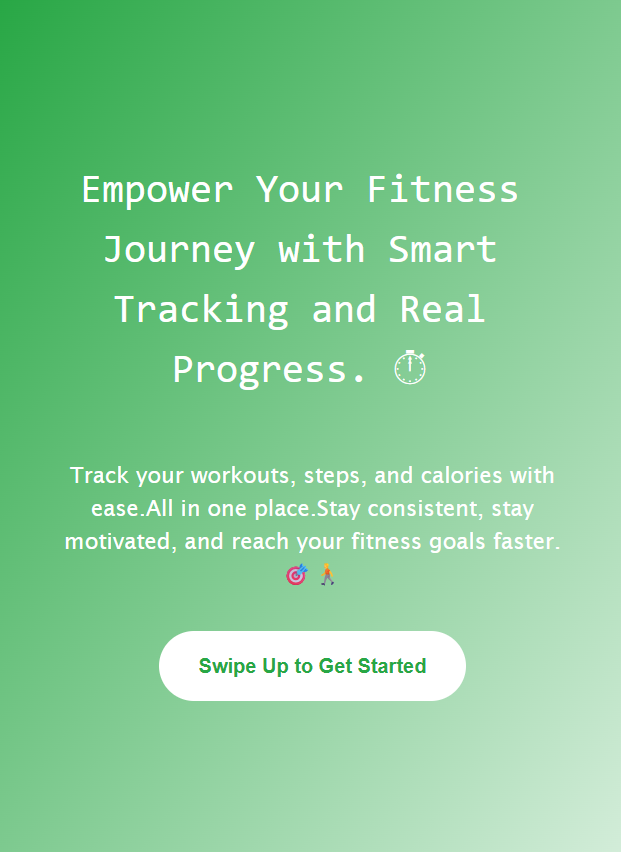
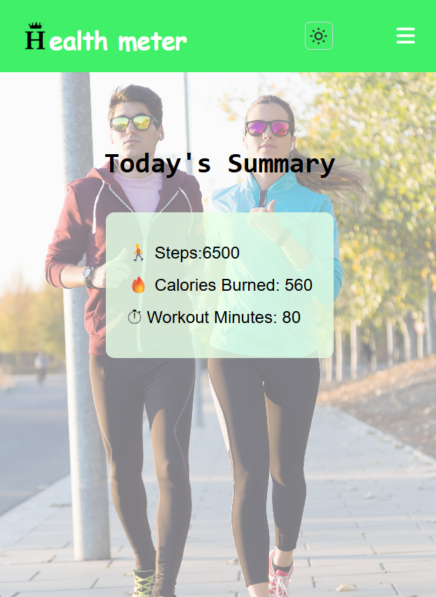
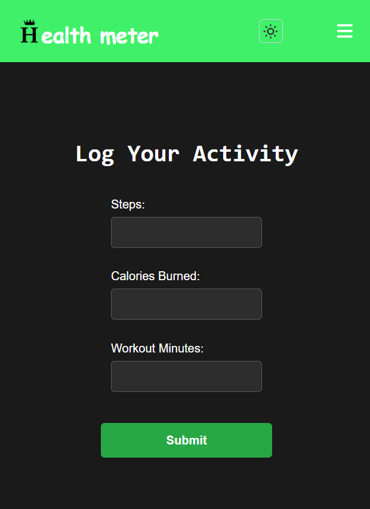
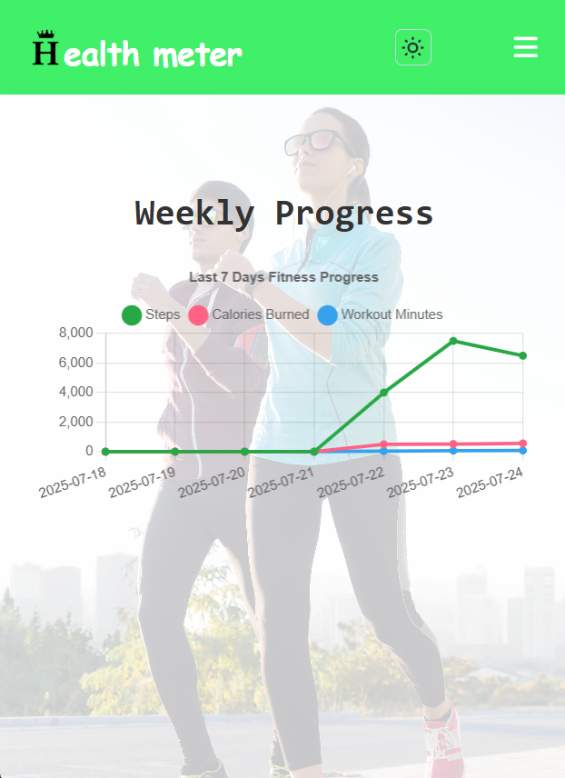
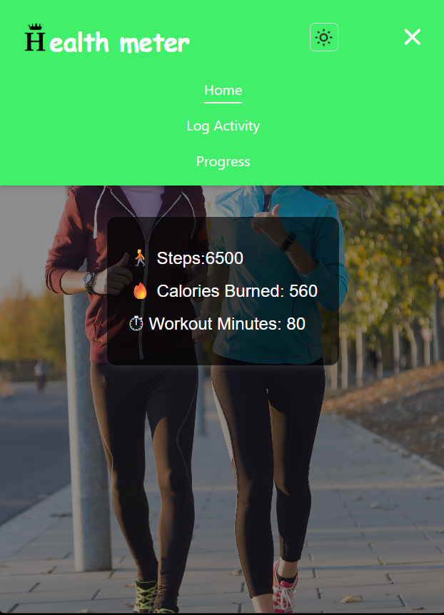

# 🏃‍♀️ Fitness Tracker App

A simple and modern web application that helps users track their daily fitness activities like steps, workouts, and calories burned. Built with the MERN stack (MongoDB, Express.js, React.js, Node.js), the app is fast, responsive, and beginner-friendly.

---

## 🎯 Why I Created This App

As people become more health-conscious, it's important to have a simple way to track daily physical activities. I created this app to help individuals **stay motivated and consistent** with their fitness goals by offering an easy-to-use logging and progress-tracking tool.

---

## 💡 Purpose of the App

The main purpose of this Fitness Tracker App is to:

- 📅 **Log Daily Activities** – Easily record steps, workout time, and calories burned.
- 📊 **Track Progress Over Time** – See your weekly or daily summary visually.
- 🌗 **Support Light/Dark Themes** – Enhance user experience for different preferences.
- 📱 **Be Accessible and Minimal** – A responsive design that works on any device.

---

## 🛠️ Problem & Solution

### ❌ Problem:
Most existing fitness tracking apps are either:
- Too complex for beginners
- Require login or third-party integrations
- Do not offer customizable logging or UI themes

### ✅ My Solution:
This app provides:
- A **login-free** simple interface
- **Fast performance** with local data storage (or optional database integration)
- **Dark/light mode** for user comfort
- An **activity summary** section to visually track daily progress

---

## 🚀 Features

- 📝 Log steps, workout minutes, and calories
- 📊 Progress page with visual summaries
- 🌗 Dark/light theme toggle
- 📱 Mobile responsive UI
- 💾 Backend support with MongoDB

---
## 🖥️ UI Screenshots

### 📍 Landing Page


### 🏠 Home Page


### 📝 Log Activity Page


### 📊 Progress Summary Page


### 📊 Navigation bar


---

## 🛠️ Tech Stack

**Frontend:**
- React.js
- Tailwind CSS
- Context API
- React Router DOM

**Backend:**
- Node.js
- Express.js
- MongoDB (Mongoose)

---

## 📦 Installation

```bash
git clone https://github.com/your-username/fitness-tracker-app.git
cd fitness-tracker-app
npm install
npm start